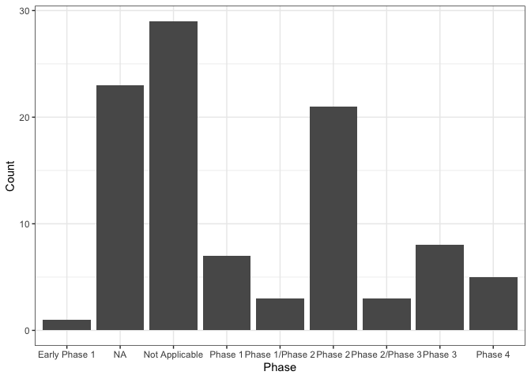

<!-- README.md is generated from README.Rmd. Please edit that file -->

# bis620.2023

<!-- badges: start -->

[](https://github.com/aespears/bis620.2023/actions/workflows/R-CMD-check.yaml)
<!-- badges: end -->

The goal of bis620.2023 is to …

## Installation

You can install the development version of bis620.2023 from
[GitHub](https://github.com/) with:

``` r
# install.packages("devtools")
devtools::install_github("aespears/bis620.2023")
```

## Example

This package makes use of various tools for visualizing and comparing
clinical trials data, including their condition, phase, and duration. It
also includes a shiny app that can be viewed to explore clinical trial
data.

``` r
library(bis620.2023)
#> Warning: replacing previous import 'dplyr::sql' by 'dbplyr::sql' when loading
#> 'bis620.2023'
studies |> head(100) |>
  plot_phase_histogram()
```


